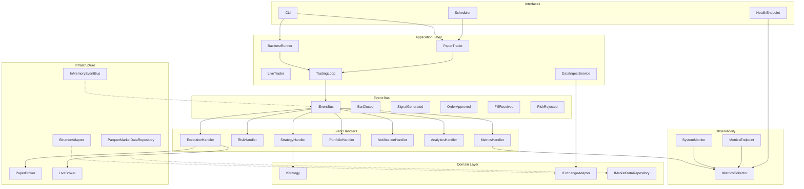
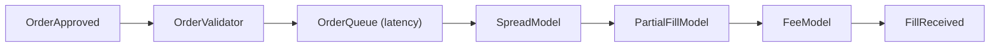
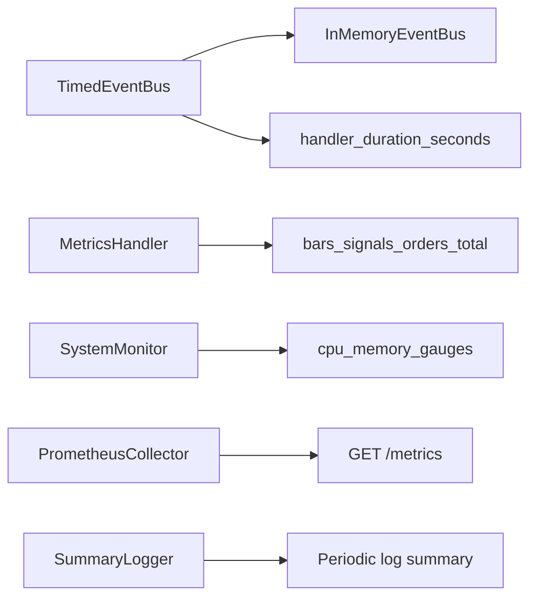

# Architecture

## Executive Summary

A modular, extensible trading platform — not a monolithic bot. Strategies emit
signals; a risk engine approves or rejects them; execution fills orders.
Every module communicates through a typed, in-process **event bus** — no
module calls another directly. Operational metrics (throughput, handler
latency, CPU/memory) are collected from Milestone 0 onward, in every mode
(backtest, paper, live).

The first vertical slice targets **BTC/USDT on Binance** via a pluggable
exchange adapter, with **Parquet** historical data, **realistic backtesting**
(spread, partial fills, order latency, maker/taker fees, exchange precision
rules), paper trading, and Docker/VPS deployment.

## Layer Model (Clean Architecture + Event Bus)



Milestone 0 implements everything in `observability`, the event bus
(`InMemoryEventBus` + `TimedEventBus`), `MetricsHandler`, domain models/events/
ports, config, and CLI skeleton. `StrategyHandler`, `RiskHandler`,
`ExecutionHandler`, `PortfolioHandler`, `NotificationHandler`,
`AnalyticsHandler`, and the exchange/broker adapters land in later milestones
(see the project roadmap) — the wiring seams for all of them already exist in
`domain/ports/` and `container.py`.

## Event Flow (Paper / Live / Backtest)

All runtime modes share the same event pipeline. The `TradingLoop` (or
`BacktestEngine` replay) is the only component that drives time forward — it
publishes `BarClosed` events. Everything else reacts via subscriptions wired
in the composition root (`container.py`).

```mermaid
sequenceDiagram
    participant Loop as TradingLoop
    participant Bus as EventBus
    participant ST as StrategyHandler
    participant RK as RiskHandler
    participant EX as ExecutionHandler
    participant PF as PortfolioHandler
    participant NT as NotificationHandler
    participant AN as AnalyticsHandler

    Loop->>Bus: publish BarClosed
    Bus->>ST: on_bar_closed
    ST->>Bus: publish SignalGenerated
    Bus->>RK: on_signal
    alt Approved
        RK->>Bus: publish OrderApproved
        Bus->>EX: on_order_approved
        EX->>Bus: publish FillReceived
        Bus->>PF: on_fill
        Bus->>NT: on_fill
        Bus->>AN: on_fill
    else Rejected
        RK->>Bus: publish RiskRejected
        Bus->>NT: on_risk_rejected
    end
```

**Handler chain order** is fixed at startup (strategy → risk → execution).
Side-effect handlers (portfolio, notifications, analytics) subscribe to
downstream events and must never block the critical path.

## Dependency Rules

| Layer | May depend on | Must NOT depend on |
|-------|---------------|-------------------|
| Domain | Nothing external | Infrastructure, CLI, ccxt, pandas |
| Application | Domain interfaces + `IEventBus` | Concrete adapters, handler implementations |
| Infrastructure | Domain + third-party libs | Strategy logic |
| Interfaces | Application + DI container | Direct ccxt calls; direct handler-to-handler calls |

**Event bus rule:** Modules publish and subscribe to **typed domain events**
only. Handlers must not import peer handlers. All subscriptions are wired in
[`container.py`](../src/trading_platform/container.py).

## Key Design Decisions

### 1. Exchange Adapter Pattern (Binance is an implementation detail)

[`IExchangeAdapter`](../src/trading_platform/domain/ports/exchange.py) defines
`fetch_ohlcv`, `fetch_instrument_rules`, `place_order`, `cancel_order`, and
`get_balance`. All ccxt/Binance code will live in `exchanges/binance/`
(Milestone 1). Application code depends only on the port.

### 2. Market Data Repository (Parquet canonical)

[`IMarketDataRepository`](../src/trading_platform/domain/ports/market_data.py)
abstracts historical OHLCV storage. Parquet layout (Milestone 1):
`data/ohlcv/{exchange}/{symbol}/{timeframe}/YYYY-MM.parquet`. Future backends
(SQLite, S3, TimescaleDB) implement the same port.

### 3. Strategy Plugin Contract

Strategies implement
[`IStrategy`](../src/trading_platform/domain/ports/strategy.py):

```python
class IStrategy(Protocol):
    def on_start(self, ctx: StrategyContext) -> None: ...
    def on_bar(self, bar: Bar, ctx: StrategyContext) -> list[Signal]: ...
    def on_stop(self, ctx: StrategyContext) -> None: ...
```

`StrategyContext` (Milestone 3) is itself a `Protocol` — not a concrete
class — so `domain/ports/strategy.py` never needs to import `pandas` or
`indicators/`; it exposes:

- `symbol`, `timeframe`, `params` (strategy-specific config from `config/*.yaml`)
- `indicator(name, bars, **kwargs) -> float`: latest value of a named
  indicator (`indicators.IndicatorRegistry`) computed over a bar sequence the
  strategy accumulates itself (`on_bar` only ever receives one new `Bar` at a
  time — no history is pushed in). Returns `NaN` on insufficient history.
- `position_for(symbol) -> Position | None`: read-only positions, backed by
  [`IPositionProvider`](../src/trading_platform/domain/ports/portfolio.py).
  Milestone 3 wires the stub `NullPositionProvider` (always flat — no
  position tracking exists yet); Milestone 6's `PortfolioHandler` supplies
  the real implementation later with no strategy-facing change.

[`StrategyHandler`](../src/trading_platform/strategies/handler.py) adapts one
strategy instance to the event bus: subscribes to `BarClosed` filtered to its
own symbol/timeframe, calls `on_start` once lazily, and publishes a
`SignalGenerated` (reusing the triggering bar's `correlation_id`) per
returned `Signal`. Running several strategies (or one strategy across several
symbols) means constructing several `StrategyHandler`s — nothing in the class
itself changes. **Not yet wired into `container.py`**: there is no
`TradingLoop`/`BacktestEngine` to drive `BarClosed` for a real trading mode
until Milestone 4, and wiring it prematurely would react to the
`BarClosed(mode="ingest")` events `download-data` already publishes.

`StrategyHandler` is also the one place every strategy's output passes
through regardless of which strategy produced it, so it enforces two
invariants no individual strategy plugin can be trusted to get right on its
own:

- **Identity.** It overwrites `Signal.strategy_name` with its own `name`
  (typically `strategies.loader.describe_strategy(path, symbol, params)`,
  e.g. `"SmaCrossoverStrategy[BTC/USDT](fast_period=5,slow_period=20)"`)
  before publishing. Two instances of the *same* strategy class with
  different params — a fast 5/20 crossover and a slow 20/60 crossover on the
  same symbol, say — get automatically distinct, self-describing identities
  in every metric/log/signal downstream, and the symbol is baked in too, so
  the same class+params on two different instruments never look identical
  either. No strategy author ever hand-picks or plumbs through a name, so
  there's no risk of two configs colliding on one, or a strategy simply
  forgetting to set it correctly.
- **Symbol integrity.** Every returned `Signal.symbol` must match the
  triggering `Bar.symbol`, or the handler raises rather than publishing a
  mismatched signal silently.

[`StrategyLoader`](../src/trading_platform/strategies/loader.py) resolves a
strategy purely from a `"module:ClassName"` config string
(`config.strategy.path` / `config.strategy.params`) via `importlib` — adding
a strategy is a new file + that one config string, with zero changes to the
loader or any other core module (empirically verified, not just asserted —
see the M3 milestone doc). After construction, it also checks
`isinstance(strategy, IStrategy)` (`IStrategy` is `@runtime_checkable`) so a
strategy missing `on_start`/`on_bar`/`on_stop` fails immediately with a clear
`StrategyError`, instead of an `AttributeError` surfacing later, mid-run,
inside `StrategyHandler`.

A shared conformance-check helper
([`tests/unit/strategies/conformance.py`](../tests/unit/strategies/conformance.py))
runs strategy-agnostic checks — lifecycle hooks that don't raise, no crash on
a single bar, every signal's symbol matches its triggering bar, deterministic
output — against any `IStrategy`. Every strategy's own test file calls it
alongside its algorithm-specific assertions (see
`tests/unit/strategies/examples/test_sma_crossover.py`), so a new strategy
inherits these checks by construction rather than by remembering to write
them.

Strategies must have **zero imports** from `exchanges/`, `execution/`, or
`ccxt`, and must be fully testable with synthetic `Bar` sequences — see the
reference [`SmaCrossoverStrategy`](../src/trading_platform/strategies/examples/sma_crossover.py).

### 4. Internal Event Bus (In-Process Pub/Sub)

The event bus is the **primary integration mechanism** between modules,
avoiding direct imports between strategy, risk, execution, portfolio,
analytics, and notifications.

- **Port:** [`IEventBus`](../src/trading_platform/domain/ports/event_bus.py)
- **Implementation:** [`InMemoryEventBus`](../src/trading_platform/infrastructure/event_bus/in_memory.py) —
  synchronous, single-threaded, deterministic. Handlers for a given event type
  run in registration order.
- **Domain events** ([`domain/events/`](../src/trading_platform/domain/events/)):
  frozen dataclasses with `kw_only=True` fields, carrying a `correlation_id`
  and `timestamp` (see [`base.py`](../src/trading_platform/domain/events/base.py)).

| Event | Published by | Consumed by |
|-------|-------------|-------------|
| `BarClosed` | `TradingLoop` (via `BacktestEngine`, M4) | `StrategyHandler` |
| `SignalGenerated` | `StrategyHandler` | `RiskHandler` |
| `OrderApproved` | `RiskHandler` | `ExecutionHandler` |
| `RiskRejected` | `RiskHandler` | NotificationHandler (M7) |
| `OrderRejected` | `ExecutionHandler` | NotificationHandler (M7), AnalyticsHandler (M5) |
| `FillReceived` | `ExecutionHandler` (synchronous fills) / `BacktestEngine` (M4, `SimBroker.process_bar` fills) | PortfolioHandler (M6), NotificationHandler (M7), AnalyticsHandler (M5) |
| `ErrorOccurred` | Any handler | NotificationHandler, logging |
| `Heartbeat` | `TradingLoop` / observability poller | NotificationHandler, health endpoint |

**Design constraints:**
- Events carry **immutable snapshots** (bar, signal, fill) — not live object references.
- Every event includes `correlation_id` and `timestamp` for tracing.
- Side-effect handlers (notifications, analytics) must catch their own
  exceptions — a failure there must never block a fill.
- Critical handlers (strategy, risk, execution) propagate exceptions so the
  loop can halt and publish `ErrorOccurred`.
- Adding a feature = new handler + subscription in `container.py` — no
  changes to existing modules.

**Future extension path:** swap `InMemoryEventBus` for a Redis/RabbitMQ
adapter implementing the same `IEventBus` port when running multi-process.
Event types remain unchanged.

### 5. Risk Sits Between Strategy and Execution (via Events)

Implemented in Milestone 4:
[`PassThroughRiskEngine`](../src/trading_platform/risk/engine.py) —
long-only, no averaging/pyramiding (a `BUY` while already in a position, or a
`SELL`/`CLOSE` while flat, is rejected outright), sizing every accepted `BUY`
via [`EquityFractionSizer`](../src/trading_platform/risk/sizing.py) (a fixed
fraction of current equity — `config.backtest.position_size_pct`, `1.0` =
100%). [`RiskHandler`](../src/trading_platform/risk/handler.py) subscribes to
`SignalGenerated` and publishes `OrderApproved` or `RiskRejected` — no direct
call from strategy to execution. True risk rules (max position size,
drawdown halt, correlation limits, ...) are unscheduled future work; they
would be composed into a rule-chain engine without changing `IRiskEngine`.

### 6. Backtest and Paper Share the Same Event Pipeline

Both modes use [`TradingLoop`](../src/trading_platform/application/trading_loop.py)
\+ `EventBus` + the same strategy/risk/execution handler chain. `TradingLoop`
itself only publishes one `BarClosed` per bar, in order — everything
mode-specific (backtest's pending-order queue draining before each bar; a
future paper loop's live-feed polling) is a `before_bar`/`after_bar` hook the
caller supplies, not logic inside `TradingLoop`.
[`BacktestEngine`](../src/trading_platform/backtesting/engine.py) (Milestone
4) is the first caller: it replays cached historical bars, drains
`SimBroker`'s pending orders against each bar *before* that bar's
`BarClosed` triggers the strategy (no look-ahead), and assembles a
`BacktestResult` (trade log + equity curve). A future paper loop reuses
`TradingLoop` unchanged with a live bar source and a `PaperBroker`; both
`SimBroker` and `PaperBroker` will delegate to the same `FillSimulator`
pipeline so fill realism stays consistent across modes.

### 7. Realistic Backtest Fill Simulation (Milestone 4)

Backtesting models exchange microstructure constraints, not just bar-close
fills with a flat fee. [`SimBroker`](../src/trading_platform/backtesting/broker_sim.py)
(the backtest's `IBroker`) enqueues every `OrderApproved`-derived order into an
[`OrderQueue`](../src/trading_platform/backtesting/order_queue.py) (tracks
per-order latency and remaining quantity across bars), then on each bar
attempts a fill via [`FillSimulator`](../src/trading_platform/backtesting/fill_simulator.py):



- [`execution/order_validator.py`](../src/trading_platform/execution/order_validator.py) —
  exchange-rule-level rejection (`min_qty`/`min_notional`), run by
  `ExecutionHandler` before an order ever reaches the broker. Distinct from
  Risk's trading-policy-level rejections (already in a position, nothing to
  close).
- [`backtesting/models/latency_model.py`](../src/trading_platform/backtesting/models/latency_model.py) +
  `OrderQueue` — an order submitted reacting to bar N can only fill starting
  at bar N+1 (`config.backtest.latency_bars`), eliminating look-ahead bias.
- [`backtesting/models/spread_model.py`](../src/trading_platform/backtesting/models/spread_model.py) —
  a `BUY` fills at `mid + half_spread`, a `SELL` at `mid - half_spread`
  (`config.backtest.spread_bps`), always worse than the mid price.
- [`backtesting/models/partial_fill_model.py`](../src/trading_platform/backtesting/models/partial_fill_model.py) —
  caps one bar's fillable quantity to a fraction of that bar's volume
  (`config.backtest.volume_participation_rate`); a large order fills across
  several bars, the remainder re-offered each time via `OrderQueue`.
- [`backtesting/models/fee_model.py`](../src/trading_platform/backtesting/models/fee_model.py) —
  market orders and limit orders that cross on submission are taker; a
  non-crossing limit order is maker if `config.backtest.assume_maker_on_limit`.

`InstrumentRules` (`tick_size`, `step_size`, `min_qty`, `min_notional`,
`price_precision`, `qty_precision`, `maker_fee_rate`, `taker_fee_rate`) are
fetched from the exchange adapter and cached to
`data/instruments/{exchange}/{symbol}.json`. Rounding lives in
[`execution/precision.py`](../src/trading_platform/execution/precision.py),
shared by `SimBroker` today and by `PaperBroker`/`LiveBroker` later.

An in-memory [`BacktestLedger`](../src/trading_platform/backtesting/ledger.py)
(not the real, event-driven, persisted `PortfolioHandler` — that's Milestone
6) tracks cash/positions/realized P&L from every fill, and is what
`PassThroughRiskEngine` sizes against (`IPortfolioView`).

`PassThroughRiskEngine` guards cash sufficiency: after `EquityFractionSizer`
sizes a `BUY` against equity at the signal bar's close, `_affordable_quantity`
shrinks it (never increases it) so its worst-case cost — price padded by the
instrument's `taker_fee_rate` plus `config.backtest.cash_safety_buffer_pct`
— never exceeds actual cash on hand, closing the gap where the real fill
(later bar, spread-adjusted price, fee) could otherwise cost more than the
signal-time estimate. Rejected outright (`RiskRejected`, "insufficient cash")
if nothing affordable remains.

`main.py`'s `download-data` and `backtest` commands both scan loaded bars
with [`market_data/gaps.py`](../src/trading_platform/market_data/gaps.py)
and print a warning (never a hard failure) if any stretch is spaced further
apart than one timeframe interval — a silent gap (exchange downtime, rate
limiting) can otherwise skew a backtest's results without any indication
anything is wrong.

Configured via `config/backtest.yaml` (`starting_cash`, `position_size_pct`,
`cash_safety_buffer_pct`, `spread_bps`, `latency_bars`,
`volume_participation_rate`, `assume_maker_on_limit`, `use_next_bar_open`),
which also selects the strategy to run (`strategy.path`/`strategy.params`) —
run with `trading-platform backtest` (requires `download-data` to have been
run first; never talks to an exchange itself).

**Limitations (by design, documented rather than hidden):**
- OHLCV-only data cannot reproduce true L2 order book dynamics — spread and
  partial fills are *approximations*.
- Intrabar price path is unknown — a limit fill is assumed if the bar's
  high/low range crosses the limit price.
- `InstrumentRules` is a single current snapshot (with a TTL cache, not a
  historical record) fetched from the exchange's *live* API — a backtest
  over 2020 data still validates/rounds/fees orders against 2026's tick
  size, step size, and fee schedule. Minor for BTC/USDT specifically (these
  have been fairly stable), but a real residual look-ahead if applied to an
  instrument whose rules changed materially over the backtested range.
  Point-in-time rule versioning is unscheduled future work.
- Hold-out IS/OOS validation is available via `validation.enabled` in
  `config/backtest.yaml` (M4.5 Phase A) — enable it and set `train_end` /
  `test_start` so tuning does not contaminate the held-out window. Full
  walk-forward optimization via `trading-platform walk-forward`
  (`validation.walk_forward` in `config/backtest.yaml`, M4.5 Phase C).
- Spread defaults to flat `spread_bps`; set `spread_volatility_k > 0` to
  widen fills with Wilder's ATR (M4.5 Phase B). Partial fills remain a
  volume-participation approximation — still more optimistic than a real
  order book in a flash crash.
- Future upgrade path: tick/trade data feed for higher-fidelity simulation
  without changing the `FillSimulator` interface.

### 8. Configuration Split

| Source | Contents |
|--------|----------|
| `config/*.yaml` | Symbols, timeframes, strategy params, backtest/observability tuning |
| Environment variables | API keys, Telegram token, `LOG_LEVEL`, `ENV=paper\|live` |
| `.env` (local only, gitignored) | Convenience for dev; never committed |

[`Settings`](../src/trading_platform/config/settings.py) (Pydantic
`BaseSettings`) owns every env-backed field. [`config/loader.py`](../src/trading_platform/config/loader.py)
loads and deep-merges YAML into a validated `AppConfig`. Never mix the two —
secrets never go in YAML, and strategy/backtest params never go in env vars.

### 9. Operational Observability (Metrics from Day One)

**Distinction:** [`observability/`](../src/trading_platform/observability/)
collects **runtime/system metrics** (throughput, latency, CPU). `analytics/`
(Milestone 5) computes **trading performance** (Sharpe, drawdown, P&L). These
must not be conflated.



**Port:** [`IMetricsCollector`](../src/trading_platform/domain/ports/metrics.py) —
a thin abstraction over `prometheus_client` for testability (see
`tests/conftest.py::FakeMetricsCollector`).

#### Metric Catalog

| Metric | Type | Labels | Source |
|--------|------|--------|--------|
| `trading_bars_processed_total` | Counter | `mode`, `symbol` | `MetricsHandler` on `BarClosed` |
| `trading_signals_generated_total` | Counter | `strategy`, `symbol` | `MetricsHandler` on `SignalGenerated` |
| `trading_orders_submitted_total` | Counter | `symbol`, `side` | `MetricsHandler` on `OrderApproved` |
| `trading_orders_rejected_total` | Counter | `reason` | `MetricsHandler` on `OrderRejected`, `RiskRejected` |
| `trading_fills_received_total` | Counter | `symbol`, `fee_type` | `MetricsHandler` on `FillReceived` |
| `trading_events_published_total` | Counter | `event_type` | `TimedEventBus` |
| `trading_handler_duration_seconds` | Histogram | `handler`, `event_type` | `TimedEventBus` per handler invocation |
| `trading_handler_errors_total` | Counter | `handler`, `error_type` | `TimedEventBus` on handler exception |
| `trading_memory_rss_bytes` | Gauge | — | `SystemMonitor` (psutil) |
| `trading_cpu_percent` | Gauge | — | `SystemMonitor` (psutil) |
| `trading_process_uptime_seconds` | Gauge | — | `SystemMonitor` |

Each metric **name** must always be called with the same fixed label-key set —
`PrometheusMetricsCollector` lazily creates one Prometheus object per (name,
label-keys) pair and Prometheus does not support redefining a metric's labels.

**Derived rates** (bars/sec, signals/sec, orders/sec) and **latency
percentiles** (p99 per handler) are computed in-process by
[`SummaryTrackingMetricsCollector`](../src/trading_platform/observability/summary.py)
and logged periodically (default every 60s, see
`config/observability.yaml::log_summary_interval_sec`) in the shape:

```json
{"bars_per_sec": 42.5, "signals_per_sec": 0.1, "orders_per_sec": 0.05,
 "strategy_latency_p99_ms": 1.2, "risk_latency_p99_ms": 0.3, "execution_latency_p99_ms": 0.8,
 "memory_rss_mb": 128, "cpu_percent": 4.2}
```

The same rates can also be computed via PromQL `rate()` once a real
Prometheus server scrapes `/metrics` (Milestone 9).

#### Exposure

- **M0:** `GET /metrics` (Prometheus text format), `GET /health` (process up +
  uptime). Both served by [`observability/server.py`](../src/trading_platform/observability/server.py),
  on `METRICS_PORT`/`HEALTH_PORT` (default 9090/8080).
- **M6+:** `/health` extended with last bar timestamp, feed status, metrics freshness.
- **M9:** Docker Compose publishes both ports; optional Prometheus sidecar.

### 10. Logging Modes

- **Regular:** INFO to stdout, human-readable text.
- **Debug:** DEBUG + JSON structured logs, controlled by `LOG_LEVEL`/`LOG_FORMAT`.
- Every order, signal, fill, and risk rejection gets a structured log event
  with `correlation_id` (see [`utils/logging.py`](../src/trading_platform/utils/logging.py)).
- Event bus publishes/handler invocations are logged at DEBUG.
- Periodic metrics summary logged at INFO when `log_summary_enabled: true`.
- Per-logger level overrides (e.g. quieting `uvicorn.access`) live in
  `config/logging.yaml`, applied on top of the global level.

## Risks & Mitigations

| Risk | Impact | Mitigation |
|------|--------|------------|
| Look-ahead bias in backtest | False confidence | Latency model delays fills to N+1 bar (M4); document OHLCV limitations |
| OHLCV-only fill approximation | Overstated strategy edge | Model spread/partials conservatively; document assumptions |
| ccxt API changes | Broken adapter | Adapter isolation; contract tests with recorded fixtures |
| Paper ≠ live fill quality | Strategy fails live | Shared `FillSimulator` between backtest and paper |
| Accidental live trading | Financial loss | Double env gate (`ENV=live` + `LIVE_TRADING_ENABLED=true`); paper is the default |
| Event handler ordering bugs | Wrong fill sequence | Explicit registration order in `container.py`; tests assert event sequence |
| Side-effect handler failure | Missed notification | Never let `NotificationHandler` block `ExecutionHandler` |
| Metrics overhead in hot path | Slower backtest | `TimedEventBus` is a thin wrapper; disable via `observability.enabled: false` |
| Over-engineering early | Slow delivery | In-memory sync bus only; no external broker until multi-process need |
| Cash-sufficiency gap (100% sizing overdraws cash) | Ledger cash goes negative | `PassThroughRiskEngine._affordable_quantity` caps order size by cash + fee/spread buffer (M4) |
| Silent gaps in downloaded/backtested bars | Misleading equity curve | `market_data/gaps.py` scan + CLI warning on `download-data`/`backtest` (M4) |
| Overfitting / data-snooping (one full-history backtest, hand-tuned params) | Strategy looks good in-sample, fails live | M4.5 hold-out (`validation.enabled`); walk-forward (`walk-forward` CLI) ([`m4.5-…`](milestones/m4.5-backtest-validation-and-realism.md)) |
| Point-in-time instrument rules (current snapshot applied to historical bars) | Rules mismatch for older/changed instruments | Documented limitation; acceptable for BTC/USDT today, versioned rules unscheduled future work |

## Roadmap

Full milestone breakdown (goals, deliverables, tests, acceptance criteria) is
tracked in the project plan and mirrored under [`docs/milestones/`](milestones/)
as each milestone lands.

| Milestone | Status | Doc |
|-----------|--------|-----|
| M0 — Foundation | Complete | [`m0-foundation.md`](milestones/m0-foundation.md) |
| M1 — Historical Data | Complete | [`m1-historical-data.md`](milestones/m1-historical-data.md) |
| M2 — Indicator Engine | Complete | [`m2-indicator-engine.md`](milestones/m2-indicator-engine.md) |
| M3 — Strategy Engine | Complete | [`m3-strategy-engine.md`](milestones/m3-strategy-engine.md) |
| M4 — Backtesting Engine | Complete | [`m4-backtesting-engine.md`](milestones/m4-backtesting-engine.md) |
| M4.5 — Backtest Validation & Realism | Complete (A+B+C) | [`m4.5-backtest-validation-and-realism.md`](milestones/m4.5-backtest-validation-and-realism.md) — hold-out IS/OOS, volatility-aware spread, walk-forward grid search |
| M5 — Performance Analytics | Complete | [`m5-performance-analytics.md`](milestones/m5-performance-analytics.md) — Sharpe, drawdown, regime splits, significance flags |
| M6 — Paper Trading | Complete | [`m6-paper-trading.md`](milestones/m6-paper-trading.md) — live closed-bar poll, virtual fills, JSON portfolio state |
| M7+ — Notifications, Live, Docker | Planned | — |

**Recommended build order after M4:** ~~M4.5 A+B~~ ✅ → ~~M5~~ ✅ → ~~M4.5 C~~ ✅ → ~~M6~~ ✅ → M7+.
