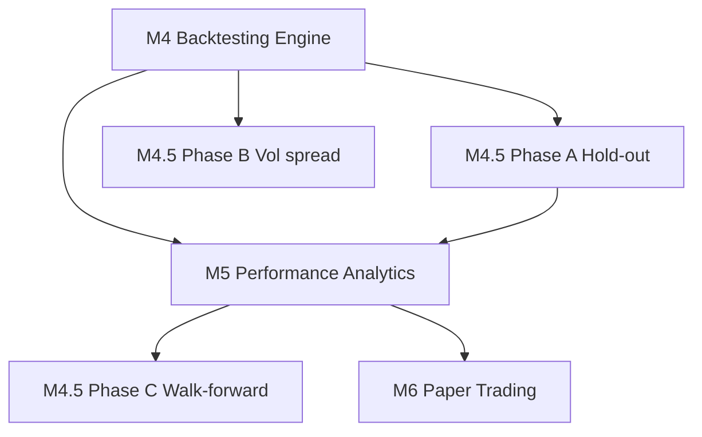

# Milestone 5 — Performance Analytics

**Status:** Complete

**Depends on:** Milestone 4 (Backtesting Engine); Milestone 4.5 Phase A
recommended (hold-out validation) so analytics can report IS vs OOS separately.

**Unblocks:** Milestone 4.5 Phase C (walk-forward optimizer objective),
Milestone 6 (Paper Trading — `AnalyticsHandler` wired for live runs).

## Goals

Turn raw backtest output (`BacktestResult`: fills + equity curve) into
**actionable, honest performance reporting** — and wire the same analytics
pipeline to live/paper trading via the event bus.

Specifically:

1. **Core trading metrics** — Sharpe ratio, max drawdown, win rate, profit
   factor, average trade PnL, round-trip count. No more judging a strategy
   from headline return alone.
2. **Regime-split reporting** — break results by calendar period and/or
   market regime so "it made money" can't hide "it only worked in one bull
   quarter."
3. **Statistical significance flags** — prominently surface when a result
   is too noisy to trust (low trade count, wide bootstrap confidence
   intervals).
4. **Event-driven analytics for paper/live** — `AnalyticsHandler` subscribes
   to `FillReceived` (and optionally `OrderRejected`) and maintains running
   metrics, consistent with backtest post-run analysis.

This milestone computes **trading performance** (P&L, risk-adjusted returns).
It does **not** duplicate Milestone 0's operational metrics (bars/sec,
handler latency, CPU) — see `docs/architecture.md` §9.

## Background — why this exists

M4's `BacktestResult` intentionally stops at the trade log and equity curve:

```python
# backtesting/result.py — deliberate boundary
# Sharpe, drawdown, win rate — that's Milestone 5's analytics/
```

Without M5, common backtesting failures go undetected:

| Failure mode | Example | M5 mitigation |
|--------------|---------|---------------|
| Lucky few trades | 8 round-trips, +40% return | Trade count + significance flag |
| Regime dependency | All profit from one 3-month rally | Regime-split table |
| Hidden drawdown | +50% return with -35% max DD | Max drawdown prominently reported |
| Overfitting (IS looks great, OOS doesn't) | Tune on full history | IS/OOS metrics side-by-side (needs M4.5 Phase A) |

Walk-forward (M4.5 Phase C) needs M5 metrics to score OOS windows meaningfully
(Sharpe or Calmar as optimizer objective beats raw return).

---

## Design Decisions (confirmed)

### 1. Analytics input contract — `BacktestResult` only for backtest

Backtest path:

```
BacktestEngine.run() → BacktestResult → PerformanceReport
```

Paper/live path:

```
FillReceived → AnalyticsHandler → RunningPerformanceState
```

Both converge on the same **metric functions** in `analytics/metrics.py` —
pure functions over `(fills, equity_curve, starting_cash)`, no event-bus
dependency inside the math.

### 2. Round-trip definition

A **round-trip** = one closed cycle: position opened (BUY fill) → fully closed
(SELL fill that brings quantity to zero). Partial closes count as partial
round-trips (pro-rata PnL attribution).

Long-only (current engine) simplifies this: every SELL that fully closes a
position completes one round-trip. Document explicitly in `analytics/trades.py`.

### 3. Sharpe ratio conventions

- **Period:** daily returns from the equity curve (resample hourly equity to
  daily close — configurable later; daily is the default for crypto).
- **Risk-free rate:** `0` (standard for crypto backtests unless user
  configures otherwise later).
- **Annualization:** `sqrt(365)` for crypto (24/7 market).
- **Minimum data:** flag `"insufficient_history_for_sharpe"` if < 30 daily
  return observations.

Report Sharpe as **informational**, not as pass/fail — a Sharpe of 2.0 on 12
trades is flagged separately.

### 4. Regime classification — two tiers

**Tier 1 (ship first) — calendar splits:**

- By quarter (`2024-Q1`, `2024-Q2`, ...)
- By year
- Always available; no extra indicators needed

**Tier 2 (ship in same milestone if time) — market regime:**

| Regime | Rule (BTC/USDT single-symbol) |
|--------|-------------------------------|
| `bull` | Close > 200-period SMA **and** 200-SMA slope positive |
| `bear` | Close < 200-period SMA **and** 200-SMA slope negative |
| `chop` | Everything else |

Requires 200 bars of warmup before regime labels are meaningful — report
`unknown` for early bars.

Also compute **buy-and-hold benchmark** return over the same period/regime
so strategy alpha is visible ("strategy +5% in Q1 vs B&H +12%".

### 5. Statistical significance — pragmatic, not academic

Ship three concrete signals (not p-values buried in footnotes):

| Flag | Condition | User-facing message |
|------|-----------|---------------------|
| `LOW_SAMPLE_SIZE` | `round_trips < 30` | "Only N round-trips — result may be luck, not edge" |
| `LOW_BAR_COUNT` | `bars_processed < 500` | "Short history — metrics may not be representative" |
| `WIDE_BOOTSTRAP_CI` | 95% bootstrap CI on total return spans zero | "Return not statistically distinguishable from zero at 95%" |

Bootstrap: resample round-trip PnLs with replacement, 1000 iterations,
percentile CI. Pure Python + `random` with configurable seed for
reproducibility — no scipy dependency.

**Explicitly not in M5 v1:** Monte Carlo permutation tests, autocorrelation-adjusted
t-tests, deflated Sharpe ratio. Document as future enhancements.

### 6. `AnalyticsHandler` scope for M5

Subscribe to:
- `FillReceived` — update running trade log, equity estimate, metrics
- `OrderRejected` / `RiskRejected` — increment rejection counters (optional
  metric: `signals_rejected_total`)

Do **not** subscribe to `BarClosed` — equity mark-to-market for open
positions needs mark prices; defer continuous equity curve to M6's
`PortfolioHandler` (which owns positions). For M5 paper mode, report metrics
on **closed trades only** plus a note that open-position MTM is excluded.

Backtest mode bypasses `AnalyticsHandler` entirely — post-run analysis over
the complete `BacktestResult` is strictly more accurate.

### 7. CLI output shape

Extend `trading-platform backtest` summary (and add `--report json` for
machine-readable output):

```
=== Backtest Result ===
Bars processed:     8760
Round-trips:        47
Total return:       12.34%
Max drawdown:       -8.21%
Sharpe (daily):     1.12
Win rate:           55.3%  (26W / 21L)
Profit factor:      1.45

⚠ LOW_SAMPLE_SIZE: Only 47 round-trips — treat with caution (recommend ≥30)

=== Regime Breakdown (calendar quarters) ===
Period      Return   MaxDD   Round-trips   B&H Return
2024-Q1     +4.2%    -3.1%        12       +18.3%
2024-Q2     -1.8%    -8.2%        11        +2.1%
...

=== Out-of-sample (if M4.5 hold-out enabled) ===
(same metrics block for OOS window only)
```

---

## Deliverables

### Core analytics module

| Component | Path | Role |
|-----------|------|------|
| Trade reconstruction | `analytics/trades.py` — `reconstruct_round_trips(fills)` | Pair BUY/SELL fills into `RoundTrip` records with PnL |
| Metrics | `analytics/metrics.py` — `compute_metrics(fills, equity_curve, starting_cash)` | Sharpe, max DD, win rate, profit factor, etc. |
| Drawdown | `analytics/metrics.py` — `max_drawdown(equity_curve)` | Peak-to-trough on equity series |
| Report type | `analytics/report.py` — `PerformanceReport` | Frozen dataclass: metrics + flags + regime tables |
| Regime splitter | `analytics/regime.py` — `calendar_splits(...)`, `market_regime_labels(bars)` | Tier 1 + Tier 2 regime classification |
| Significance | `analytics/significance.py` — `compute_flags(...)`, `bootstrap_return_ci(...)` | LOW_SAMPLE_SIZE etc. |
| Benchmark | `analytics/benchmark.py` — `buy_and_hold_return(bars, start, end)` | B&H comparison per period |

### Event-driven handler (paper/live prep)

| Component | Path | Role |
|-----------|------|------|
| Handler | `analytics/handler.py` — `AnalyticsHandler` | Subscribes `FillReceived`; maintains `RunningPerformanceState` |
| State | `analytics/state.py` — `RunningPerformanceState` | Incremental fill log + cached metric snapshots |

### Integration

| Component | Path | Role |
|-----------|------|------|
| CLI | `main.py` — extend `backtest` output | Print `PerformanceReport` after `BacktestResult` |
| Container | `container.py` — wire `AnalyticsHandler` on `serve`/paper paths | Subscribes alongside existing handlers |
| Config | `config/loader.py` — `AnalyticsConfig` (optional) | Bootstrap seed, min round-trips threshold |

---

## Project Structure Changes

```
src/trading_platform/
├── analytics/
│   ├── __init__.py
│   ├── trades.py           # round-trip reconstruction
│   ├── metrics.py          # Sharpe, drawdown, win rate, profit factor
│   ├── regime.py           # calendar + market regime splits
│   ├── significance.py     # flags + bootstrap CI
│   ├── benchmark.py        # buy-and-hold comparison
│   ├── report.py           # PerformanceReport dataclass
│   ├── handler.py          # AnalyticsHandler (event bus)
│   └── state.py            # RunningPerformanceState
tests/unit/analytics/
├── test_trades.py
├── test_metrics.py
├── test_regime.py
├── test_significance.py
├── test_benchmark.py
└── test_handler.py
```

No new domain events — consumes existing `FillReceived`. No changes to
`BacktestEngine` — analytics is strictly downstream of `BacktestResult`.

---

## Metric Definitions (reference)

| Metric | Formula / rule |
|--------|----------------|
| **Total return** | `(ending_equity - starting_cash) / starting_cash` (already on `BacktestResult`) |
| **Max drawdown** | Max peak-to-trough decline on equity curve (percentage) |
| **Sharpe (daily)** | `mean(daily_returns) / std(daily_returns) * sqrt(365)`; rf=0 |
| **Win rate** | `winning_round_trips / total_round_trips` |
| **Profit factor** | `sum(winning_pnl) / abs(sum(losing_pnl))`; `inf` if no losses |
| **Avg trade PnL** | `sum(round_trip_pnl) / count(round_trips)` |
| **Round-trip count** | Closed BUY→SELL cycles (see §2 above) |

---

## Tests

### `analytics/trades.py`
- Single BUY → SELL round-trip PnL matches manual calculation (incl. fees)
- Partial sells split PnL correctly
- Multiple round-trips on same symbol in sequence
- Empty fills → zero round-trips, no crash

### `analytics/metrics.py`
- Max drawdown on known equity curve (e.g. 100 → 120 → 90 → 110 = -25% DD)
- Sharpe on constant-upward equity → high positive
- Sharpe on random walk → near zero (statistical test with fixed seed)
- Win rate / profit factor on constructed round-trip set

### `analytics/regime.py`
- Calendar split assigns correct quarter labels
- Market regime: price above rising 200-SMA → `bull`
- Warmup period → `unknown` label

### `analytics/significance.py`
- 10 round-trips → `LOW_SAMPLE_SIZE` flag set
- 50 round-trips → flag not set
- Bootstrap CI on mixed PnLs: wide when variance high

### `analytics/handler.py`
- `FillReceived` updates running round-trip count
- Non-`FillReceived` events ignored
- Handler exceptions don't propagate (side-effect handler rule)

### Integration
- Full pipeline: synthetic `BacktestResult` → `PerformanceReport` with known values
- CLI prints report fields (typer runner test)

---

## Acceptance Criteria

| Criterion | Evidence |
|-----------|----------|
| Sharpe, max drawdown, win rate, profit factor computed from `BacktestResult` | `tests/unit/analytics/test_metrics.py` |
| Round-trip reconstruction handles fees correctly | `tests/unit/analytics/test_trades.py` |
| Calendar regime split (quarterly) produces per-period metrics | `tests/unit/analytics/test_regime.py` |
| Buy-and-hold benchmark computed per regime period | `tests/unit/analytics/test_benchmark.py` |
| `LOW_SAMPLE_SIZE` flag when round-trips < 30 | `tests/unit/analytics/test_significance.py` |
| Bootstrap 95% CI computed with reproducible seed | `tests/unit/analytics/test_significance.py` |
| `AnalyticsHandler` updates state on `FillReceived` | `tests/unit/analytics/test_handler.py` |
| `trading-platform backtest` prints extended metrics block | Manual verification + CLI test |
| `--report json` outputs serializable `PerformanceReport` (optional stretch) | JSON schema test |
| OOS metrics printed separately when M4.5 hold-out enabled | Integration test |
| `uv run pytest -m "not network"` passes | CI green |
| `uv run mypy src` / `ruff check .` / `ruff format --check .` | all clean |

---

## Verification (manual, post-implementation)

1. Run `trading-platform backtest` on ≥1 year of real BTC/USDT data.
2. Confirm round-trip count is plausible (not equal to fill count / 2 if
   partials exist).
3. Confirm max drawdown < 0 on any strategy that lost money at any point.
4. Confirm regime table shows different returns across quarters (sanity —
   unlikely all identical).
5. Confirm `LOW_SAMPLE_SIZE` appears when running backtest over ~1 month
   with a slow SMA strategy (few trades).
6. With M4.5 hold-out enabled, confirm OOS block appears and differs from IS.

---

## Relationship to other milestones



- **M4.5 Phase A before M5** is recommended so M5 can print IS/OOS blocks.
- **M4.5 Phase B** is independent — can ship anytime after M4.
- **M4.5 Phase C after M5** — optimizer needs meaningful objective (Sharpe/Calmar).
- **M6 Paper Trading** wires `AnalyticsHandler` for real-time metric exposure.

---

## Known Gaps (explicitly out of scope)

- **Sortino, Calmar, Omega ratio** — easy additions once core metrics exist;
  not required for v1 acceptance.
- **Equity curve resampling options** (hourly Sharpe, weekly) — daily only in v1.
- **Multi-symbol portfolio analytics** — single-symbol until multi-symbol
  backtest exists.
- **Persistent analytics storage / dashboard** — M7+ (notifications) or later;
  M5 is compute + CLI output only.
- **Monte Carlo permutation test, deflated Sharpe** — M5 v2 or research tooling.
- **Open-position MTM in paper mode** — needs M6 `PortfolioHandler`; M5
  reports closed-trade metrics only for live runs.

---

## Suggested Implementation Order

1. `analytics/trades.py` — round-trip reconstruction (everything else depends on this)
2. `analytics/metrics.py` — core metrics + `PerformanceReport`
3. CLI integration — extended `backtest` output (immediate user-visible value)
4. `analytics/regime.py` + `benchmark.py` — calendar splits first, market regime second
5. `analytics/significance.py` — flags + bootstrap
6. `analytics/handler.py` + container wiring — paper/live prep for M6

Estimated effort: **3–5 days** for v1 (items 1–5); item 6 adds ~1 day.
